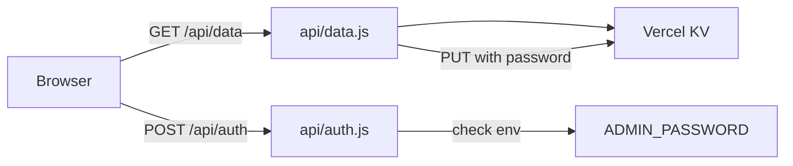

# BWF Dynamic Site — Implementation Plan

## Discovery

**Q: Kiến trúc dữ liệu?**
A: Backend + database (Vercel serverless + Vercel KV). Chỉnh sửa trên web lưu ngay lên server.

**Q: Quyền chỉnh sửa?**
A: Mật khẩu quản trị đơn giản (env var `ADMIN_PASSWORD` trên Vercel).

**Q: Cấu trúc dữ liệu?**
A: Giữ nguyên mô hình hiện tại (event, contents → groups/participants, matches). Seed bằng dữ liệu VĐV từ `aaa.txt`, chưa có trận đấu.

**Q: Database cụ thể?**
A: Vercel KV (Redis) — lưu cả object JSON dưới 1 key.

**Q: Tính năng cải thiện?**
A: Tự sinh trận vòng bảng (round-robin), quản lý nội dung tốt hơn (form thay vì prompt), nhập kết quả nhanh hơn.

**Research:**
- Đã đọc `index.html` (767 dòng, CSS trong `<style>`, JS trong `<script>`)
- Đã đọc `data.json` (6 nội dung, cấu trúc event/contents)
- Đã đọc thể lệ `Ke_hoach_Giai_Cau_long_BWF.docx`: Đơn nam/nữ chia 2 bảng vòng tròn → bán kết/chung kết; Đôi nam/nữ Swiss → nhánh Thắng/Thua → chung kết
- Đã đọc `aaa.txt`: danh sách VĐV thực tế (8 đơn nam, 6 cặp đôi nam, 8+6 cặp đôi nam nữ, 6+6 đơn nữ)

## Non-Goals

- Không xây dựng hệ thống đăng nhập đầy đủ (Google/email auth)
- Không hỗ trợ nhiều giải đấu cùng lúc (chỉ 1 sự kiện)
- Không có tính năng dashboard tổng quan riêng
- Không tự động chia nhánh Swiss (admin tự xếp cặp theo thể lệ)
- Không có realtime push (chỉ fetch khi load + lưu khi sửa)

## Ghost Diffs

- **Postgres thay vì KV** — từ chối vì dữ liệu nhỏ, KV đơn giản hơn nhiều
- **Next.js full-stack** — từ chối vì user muốn giữ HTML/CSS/JS đơn giản
- **localStorage tiếp tục** — từ chối vì user chọn backend để mọi người cùng thấy
- **Thiết kế lại data model** — từ chối, giữ cấu trúc cũ

## Design Summary

Chuyển trang tĩnh thành web động: tách `index.html` thành 3 file (HTML/CSS/JS), thêm backend Vercel serverless (`api/data.js` GET/PUT, `api/auth.js` POST) lưu vào Vercel KV, xác thực admin bằng mật khẩu. Giữ nguyên giao diện hiện tại, thêm: tự sinh trận vòng bảng, quản lý nội dung bằng form, nhập kết quả nhanh. Seed dữ liệu VĐV từ `aaa.txt`, chưa có trận đấu.

## Tasks

### 1. Backend API — Vercel serverless + KV
- **Depends on**: none
- **Files**:
  - Create `api/data.js`
  - Create `api/auth.js`
  - Create `vercel.json`
  - Create `package.json` (dependency `@vercel/kv`)
- **What**: 
  - `api/data.js`: `GET` → read `bwf:data` from KV, fallback to seed `data.json`; `PUT` → verify `Authorization: Bearer <ADMIN_PASSWORD>`, validate body object, save to KV.
  - `api/auth.js`: `POST` with `{ password }` → compare `process.env.ADMIN_PASSWORD`, return `{ ok: true }` or 401.
  - `vercel.json`: minimal config (clean URLs, api routes).
  - `package.json`: `"type": "module"`, dependency `@vercel/kv`.
- **Must NOT**: expose password in responses; allow unauthenticated writes.
- **References**: `docs/superpowers/specs/2026-09-17-bwf-dynamic-site-design.md`
- **Verify**: `node --check api/data.js` and `node --check api/auth.js` pass (syntax).

### 2. Frontend — tách 3 file + tính năng mới
- **Depends on**: 1
- **Files**:
  - Create `styles.css` (extract from `index.html` `<style>`, giữ nguyên design)
  - Create `app.js` (extract + rewrite logic)
  - Modify `index.html` (bỏ `<style>`/`<script>` inline, link `styles.css` + `app.js`)
- **What**:
  - Load data từ `/api/data`, fallback `data.json`.
  - Edit mode: bấm "✏️ Chỉnh sửa" → nhập mật khẩu → `POST /api/auth` → vào chế độ sửa.
  - Mọi thay đổi trong edit mode gọi `PUT /api/data` (lưu server).
  - Tự sinh trận vòng bảng: nút mỗi bảng → sinh round-robin (mỗi cặp gặp nhau 1 lần, stage `Vòng bảng — <bảng>`), bỏ qua cặp đã có.
  - Quản lý nội dung: form thêm/sửa/xoá nội dung, thêm/xoá bảng, thêm/xoá VĐV.
  - Nhập kết quả: 3 ô séc mỗi trận, auto-save, bảng xếp hạng cập nhật ngay.
  - Bỏ localStorage draft flow.
- **Must NOT**: thay đổi giao diện tổng thể; phá vỡ hiển thị standings/matches hiện có.
- **References**: `index.html` (hiện tại), `docs/superpowers/specs/2026-09-17-bwf-dynamic-site-design.md`
- **Verify**: Mở `index.html` trong browser, kiểm tra render + edit mode hoạt động (API fallback khi không có server).

### 3. Seed data — data.json từ aaa.txt
- **Depends on**: none
- **Files**:
  - Modify `data.json`
- **What**: Thay dữ liệu cũ bằng dữ liệu VĐV từ `aaa.txt`:
  - Đơn nam (8): Bảng A (Phan Văn Thịnh, Lâm Vĩ Phát, Trịnh Hoàng Trí, Nguyễn Hoàng Hải Đăng), Bảng B (Trần Hoàng Trung, Nguyễn Cao Kế, Nguyễn Minh Trường, Đỗ Thành Chung)
  - Đơn nữ Nhóm 1 (6): Bảng A (Bùi Tuệ San, Huỳnh Thị Thoại My, Trần Minh Thư), Bảng B (Lý Thanh Trúc, Nguyễn Thụy Thảo Vy, Trần Thu Trang)
  - Đơn nữ Nhóm 2 (6): Bảng A (Nguyễn Ngọc Hạnh, Phan Huỳnh Thanh Ngọc, Nguyễn Ngọc Yến Nhi), Bảng B (Mai Nguyễn Gia Nhi, Huỳnh Trần Khánh Băng, Lê Thị Hồng Phượng)
  - Đôi nam (6 cặp, Swiss): Trần Thái An - Nguyễn Cao Kế, Nguyễn Minh Trường - Nguyễn Đức Tuấn, Đỗ Thành Chung - Nguyễn Đình Triết, Nguyễn Trí Việt - Nguyễn Xuân Hoàng Khôi, Đỗ Anh Quân - Phan Văn Thịnh, Trịnh Hoàng Trí - Nguyễn Hoàng Hải Đăng
  - Đôi nam nữ Nhóm 1 (8 cặp, Swiss): (8 cặp từ aaa.txt)
  - Đôi nam nữ Nhóm 2 (6 cặp, Swiss): (6 cặp từ aaa.txt)
  - Event: dateRange "30/9 – 04/10/2026", location "Sân cầu lông Đồng Đội"
  - `matches: []` cho tất cả nội dung (giải chưa diễn ra)
  - scoringNote theo thể lệ (Đơn nam/Đôi: 2/3 séc, 21-21-15; Đơn nữ: 2/3 séc, 15 mỗi séc)
- **Must NOT**: thêm trận đấu giả; đổi id/label không khớp với aaa.txt.
- **Verify**: `Get-Content data.json | ConvertFrom-Json` parse thành công; đếm số VĐV khớp aaa.txt (8+6+6+12+16+12 = 60 người/cặp).

### 4. README + package.json + verification
- **Depends on**: 2, 3
- **Files**:
  - Modify `README.md`
  - Create `package.json` (nếu chưa có ở task 1)
- **What**:
  - README: hướng dẫn chạy local (`vercel dev`), deploy lên Vercel, tạo KV store, set `ADMIN_PASSWORD`.
  - Kiểm tra toàn bộ: syntax check JS, JSON hợp lệ, không còn inline `<style>`/`<script>` trong index.html.
- **Must NOT**: thêm dependency không cần thiết.
- **Verify**: `node --check app.js` pass; `Get-Content data.json | ConvertFrom-Json` pass; grep index.html không còn `<style>`/`<script>` inline.